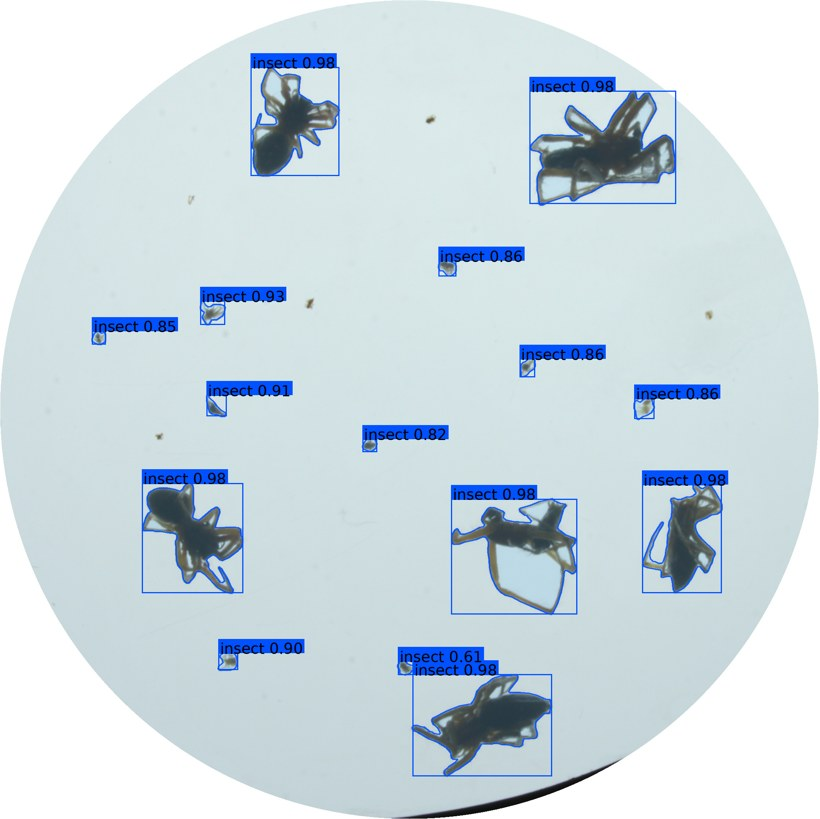
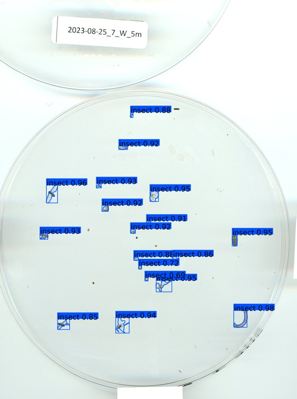

# SAM 3 for Insects

**Detection and instance segmentation of terrestrial arthropods with a fine-tuned Segment Anything 3.**

[](https://colab.research.google.com/github/adambasha0/SAM3-for-Insects-segementation/blob/main/docs/sam3_insect_colab.ipynb)
[-orange.svg)](https://github.com/adambasha0/SAM3-for-Insects-segementation/releases/tag/checkpoint-18)
[](https://huggingface.co/tea98/sam3-for-insects-segmentation)
[](LICENSE)

Point it at a photograph of a trap, a Petri dish, a sticky card or a leaf, and it returns one
instance mask, one bounding box and one confidence per insect. Predictions come out as COCO JSON.

Two things make it work on real trap imagery rather than only on tidy close-ups:

- **Fine-tuning.** Meta's [SAM 3](https://github.com/facebookresearch/sam3) is fine-tuned on the
  [flat-bug](https://github.com/darsa-group/flat-bug) aggregate — 23 insect datasets spanning lab
  scanners, pitfall traps, light traps and field photography.
- **Pyramid tiling.** A single 1024-px pass over a 20-megapixel trap scan shrinks a 30-pixel fly to
  nothing. Instead the image is walked at several scales with overlapping tiles, following
  flat-bug's `Localizer` scheme, and detections from every level are merged with one NMS pass.

It is a **single-class detector**: it finds arthropods, it does not identify them.

<p align="center">
  
  
</p>

---

## Contents

- [Try it in Colab](#try-it-in-colab)
- [Installation](#installation)
- [Weights](#weights)
- [Usage](#usage)
- [How the tiling works](#how-the-tiling-works)
- [Configuration](#configuration)
- [Choosing a confidence threshold](#choosing-a-confidence-threshold)
- [Repository layout](#repository-layout)
- [Credits and licence](#credits-and-licence)

---

## Try it in Colab

**[▶ Open the notebook](https://colab.research.google.com/github/adambasha0/SAM3-for-Insects-segementation/blob/main/docs/sam3_insect_colab.ipynb)**
— nothing to install, no account needed beyond Google's, runs on the free T4.

The notebook installs the package, downloads and checksums the weights, and launches an
upload-and-predict interface:

| | |
|---|---|
| **Upload** an image, or start from one of three bundled examples | |
| **Predict** — a progress bar tracks the pyramid, tile by tile | |
| **Confidence slider** re-filters instantly, without re-running the model | |
| **Download** the COCO JSON, or a zip with the COCO file, the rendered overview and one PNG per insect | |

There is also a batch cell that runs a whole folder — including one mounted from Google Drive —
into a single COCO file.

Turn the GPU on first: **Runtime → Change runtime type → GPU**. On CPU the model loads but a
single image takes many minutes.

## Installation

```sh
git clone https://github.com/adambasha0/SAM3-for-Insects-segementation.git
cd SAM3-for-Insects-segementation
pip install -e .              # add ".[app]" for the Gradio interface
```

Install PyTorch (≥ 2.3, with CUDA) separately, following
[pytorch.org](https://pytorch.org/get-started/locally/), so it matches your driver.

An **editable install is intentional**: the CLIP BPE vocabulary lives in `assets/` next to the
package rather than inside it, so the code resolves it relative to the clone.

Inference needs **no HuggingFace token and no licence acceptance**: the fine-tuned checkpoint
carries every weight the model uses, so the gated `facebook/sam3` repository is never touched.

## Weights

The checkpoint is **3.14 GB of unmodified fp32 weights** — `flatbug_medium_ft`, epoch 18.

`resolve_checkpoint()` fetches it for you and refuses to hand back a file whose SHA-256 does not
match, so a truncated download fails loudly instead of quietly loading garbage:

```python
from sam3_insect import resolve_checkpoint

ckpt = resolve_checkpoint("release")               # GitHub Release, two parts, joined + verified
ckpt = resolve_checkpoint("hf")                    # HuggingFace Hub, one resumable file
ckpt = resolve_checkpoint("local", path="my.pt")   # something you already have
```

| Source | Where | Notes |
|---|---|---|
| `release` | [GitHub Release `checkpoint-18`](https://github.com/adambasha0/SAM3-for-Insects-segementation/releases/tag/checkpoint-18) | Default. Two ~1.57 GiB parts, joined and checksummed |
| `hf` | [🤗 `tea98/sam3-for-insects-segmentation`](https://huggingface.co/tea98/sam3-for-insects-segmentation) | One file, resumable — easier over a flaky link |
| `local` | A path you supply | Also accepts the full 9.39 GB training checkpoint |

### Why two parts?

GitHub caps a single file at 2 GB, so 3.14 GB cannot be one asset. Compression was measured and
rejected — fp32 weights gzip to only ~2.91 GB, still over the limit. Splitting is lossless and the
join is a plain concatenation, so you never depend on this repository's tooling to get your weights
back:

```sh
cat checkpoint_18_inference.pt.part-* > checkpoint_18_inference.pt
sha256sum -c checkpoint_18_inference.pt.sha256
```

```sh
./models/checkpoint_18_inference/fetch_weights.sh    # download + join + verify, no Python
```

```python
from sam3_insect import join_parts, INFERENCE_CKPT_SHA256
join_parts(["…part-00", "…part-01"], "checkpoint_18_inference.pt",
           expected_sha256=INFERENCE_CKPT_SHA256)
```

### Why not fp16?

Tried, and rejected. `backbone.language_backbone.encoder.text_projection` holds values up to
9.58e18 — far past fp16's 65504 ceiling — so casting turns those weights into `inf` and the model
stops detecting anything. bf16 has the range but costs ~0.14% mean relative weight error, so exact
fp32 was kept and the halving happens elsewhere: **activations** are autocast at runtime, to
bfloat16 where the GPU supports it and float16 on older cards such as the T4, which have no
bfloat16 units. Full audit in [`MODEL_CARD.md`](MODEL_CARD.md).

## Usage

### CLI

```sh
# one image; weights are fetched and cached on first run
sam3_insect_predict -i docs/examples/example_petri_dish_ALUS.jpg -o out/

# a folder, recursively, with a checkpoint you already have
sam3_insect_predict -i images/ -o out/ -R -w weights/checkpoint_18_inference.pt
```

```
out/
├── coco_instances.json      # masks as polygons, boxes as [x, y, w, h], one conf per detection
└── overviews/
    └── overview_<image>.jpg
```

| Option | Meaning |
|---|---|
| `-w`, `--weights` | Checkpoint path; omit to fetch via `--weights-source` |
| `--weights-source` | `release` (default), `hf`, `local` |
| `-R`, `--recursive` | Descend into subdirectories |
| `-n`, `--max-images` | Stop after N images |
| `-g`, `--device` | e.g. `cuda:0`, `cpu` |
| `--score-threshold` | Detection confidence floor (default 0.02) |
| `--mask-threshold` | Mask logit cut; lower grows masks, higher tightens them |
| `--config` | YAML file of any [config](#configuration) key |
| `--per-image-json` | Also write one COCO file per image |
| `--no-overviews` | Skip the renderings |

The output layout mirrors flat-bug's `fb_predict`, so predictions from the two models can be fed
to the same evaluation tooling. Each annotation carries its confidence in both `score` and `conf`,
the latter being what flat-bug's evaluator reads.

### Python

```python
from sam3_insect import InsectPredictor, annotations_to_coco, resolve_checkpoint

predictor = InsectPredictor(resolve_checkpoint("release"))

result = predictor.predict("trap_photo.jpg")
strong = [a for a in result.annotations if a["score"] >= 0.4]
print(f"{len(strong)} insects in a {result.width}×{result.height} image")

predictor.render(result, score_threshold=0.4).save("overview.jpg")
coco = annotations_to_coco(result)
```

Load the model once and reuse it — construction costs a few seconds and ~3.2 GB of VRAM, while a
prediction costs seconds.

### The app, locally

```sh
pip install -e ".[app]"
python -m sam3_insect.app --weights weights/checkpoint_18_inference.pt \
    --examples docs/examples/*.jpg
```

## How the tiling works

```
                       prompt          tiles
coarsest level  ┌───────────────┐   "insect"      1     whole image, small objects filtered out
                │   1024 px     │
      ↓ ×1.5    ├───┬───┬───────┤   "insects"     n     overlapping, 384 px minimum overlap
      ↓ ×1.5    ├─┬─┬─┬─┬─┬─┬─┬─┤   "insects"     m     detections on synthetic cuts dropped
   full res     └─┴─┴─┴─┴─┴─┴─┴─┘
                        ↓
              all candidates → one NMS (IoU 0.2) → COCO polygons
```

Three details matter for correctness. Objects touching a *synthetic* tile edge are dropped, since a
neighbouring tile sees them whole — but objects touching a real image border are kept. Each level
runs a text prompt, singular at the coarsest level and plural below it. And masks are contoured
inside their own tile, then mapped back through the tile offset and scale, so a polygon never
inherits another tile's coordinate frame.

## Configuration

Every key in `sam3_insect.DEFAULT_CFG` can be overridden per predictor, per call, or via
`--config file.yaml`. Unknown keys raise, so a typo fails loudly instead of being ignored.

```python
predictor.predict("image.jpg", cfg={"MASK_THRESHOLD": 0.35, "SCALE_BEFORE": 1.5})
```

| Key | Default | Effect |
|---|---|---|
| `TILE_SIZE` | 1024 | Model input tile edge |
| `MINIMUM_TILE_OVERLAP` | 384 | Overlap between neighbouring tiles |
| `SCALE_INCREMENT` | 2/3 | Ratio between pyramid levels |
| `EDGE_CASE_MARGIN` | 16 | Margin for the synthetic-edge filter |
| `SCORE_THRESHOLD` | 0.02 | Detection confidence floor |
| `IOU_THRESHOLD` | 0.2 | NMS threshold (`USE_IOS_NMS` switches to intersection-over-smaller) |
| `MASK_THRESHOLD` | 0.5 | Mask logit cut; lower grows masks |
| `MIN_MAX_OBJ_SIZE` | (32, 1e8) | Keep objects by √area, except at the coarsest level |
| `SCALE_BEFORE` | 1.0 | Pre-upscale so tiny insects span more model pixels |
| `MASK_DILATION_PIXELS` | 0 | Grow masks morphologically after binarisation |
| `EXIF_TRANSPOSE` | `True` | Honour the EXIF orientation tag |

Two knobs are worth reaching for when results disappoint. If masks hug the specimen too tightly,
lower `MASK_THRESHOLD` towards 0.3. If insects are simply too small to be found, raise
`SCALE_BEFORE` to 1.5 or 2.0 — coordinates are mapped back to the original image automatically.

## Choosing a confidence threshold

Raw detections extend down to very low scores, and that is expected rather than broken. SAM 3's
decoder spends a **fixed budget of 200 object queries in full on every tile** and has no per-query
"nothing here" output — a query can only decline by producing a low score. So on a tile holding
*N* insects you get ~200 predictions above 0.005 and roughly *N* above 0.5, at the same recall.

Practical consequences:

- **In the fine-tuning domain, real detections usually score above 0.8.** The app filters the
  display at 0.4 by default, which is why its output looks clean.
- **The library runs at 0.02**, not lower, because the interval below that is almost entirely the
  query floor: dropping from 0.005 to 0.02 removes roughly 70% of false positives for about 0.7 pp
  of recall.
- **On unfamiliar imagery, sweep the slider before trusting a count.** The app caches detections
  down to 0.02, so sweeping costs nothing.

## Maintainer tools

[`tools/`](tools/) holds the scripts behind the published artefacts, each with
`--help`:

| Script | What it does |
|---|---|
| `package_checkpoint.py` | Strip a training checkpoint's optimizer state, verify every tensor is unchanged, split into under-2 GB parts with a checksum |
| `publish_release.py` | Create or update a GitHub Release and upload the parts (stdlib only, no `gh` needed) |
| `publish_to_hf.py` | Create or update the HuggingFace mirror; `--whoami` first, since a fine-grained token can only write to its own namespace |

```sh
python tools/package_checkpoint.py training.pt -o dist/ --parts 2
GITHUB_TOKEN=... python tools/publish_release.py dist/ --tag checkpoint-18
HF_TOKEN=...     python tools/publish_to_hf.py dist/checkpoint_18_inference.pt --repo you/mirror
```

## Repository layout

| Path | What it holds |
|---|---|
| `sam3_insect/` | This project: tiling inference, weight fetching, COCO export, rendering, CLI, Gradio app |
| `sam3/` | Meta's SAM 3 model code — the inference-only subset |
| `assets/` | CLIP BPE vocabulary the text encoder needs |
| `docs/sam3_insect_colab.ipynb` | The Colab notebook |
| `docs/examples/` | Three example images, and rendered previews |
| `models/checkpoint_18_inference/` | Checksum, join script and download helper for the weights |
| `tools/` | Packaging and publishing scripts |
| `tests/` | Unit tests for the geometry, COCO and packaging helpers (no GPU, no weights) |
| `MODEL_CARD.md` | What the model was trained on, what it is for, and where it fails |

`sam3/` here is deliberately the **inference subset** of the upstream package — training loops,
losses, evaluation toolkits and agent code are not included. For those, use
[facebookresearch/sam3](https://github.com/facebookresearch/sam3).

## Credits and licence

This work stands on two projects, and both should be cited alongside it:

```bibtex
@article{carion2025sam3,
  title   = {SAM 3: Segment Anything with Concepts},
  author  = {Carion, Nicolas and Gustafson, Laura and others},
  journal = {arXiv},
  year    = {2025}
}

@article{flatbug,
  title   = {flat-bug: A General Method for Detection and Segmentation of
             Terrestrial Arthropods in Images},
  journal = {Methods in Ecology and Evolution},
  year    = {2025},
  url     = {https://github.com/darsa-group/flat-bug}
}
```

The tiling pyramid, the synthetic-edge filter and the COCO output format follow flat-bug's
`Localizer`, which is what makes predictions from the two models comparable. Example images come
from the flat-bug aggregate validation split (ALUS, ArTaxOr and UBC pitfall-trap subsets) and
remain under their original datasets' licences.

**Licence.** `sam3/` is Meta's code, governed by the **SAM License** in [`LICENSE`](LICENSE) — not
Apache or MIT. The fine-tuned checkpoint is a derivative work of the SAM 3 materials and is covered
by the same agreement: use, modify and redistribute it freely, but any redistribution must carry a
copy of the licence and stay within Meta's Acceptable Use Policy. Code added by this repository is
released under the same terms.

Fine-tuning was carried out by Adam Basha at Philipps-Universität Marburg. See
[`MODEL_CARD.md`](MODEL_CARD.md) for the training setup and known failure modes.
